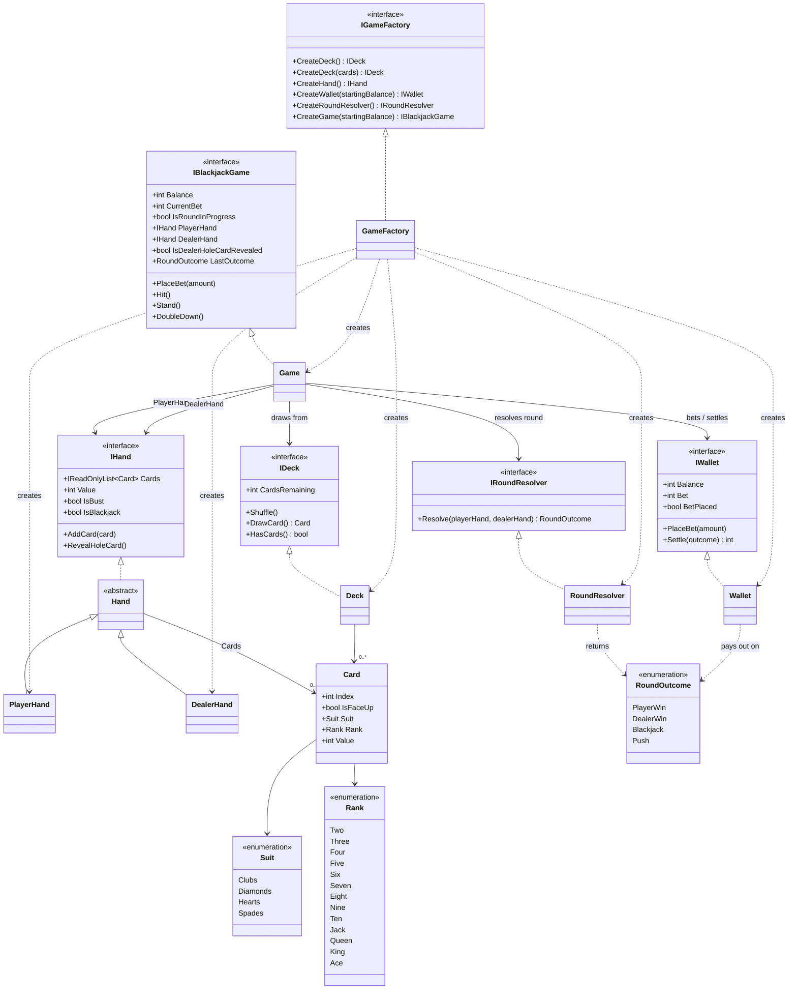

# Blackjack

A console-based, single-player-vs-dealer Blackjack game in C#, built with a
GUI-independent game engine so the rules can be tested in isolation from the
console front end.

- **Author:** Mikkel Jørgensen
- **Language:** C#
- **Target framework:** .NET 10.0

## Requirements

### Functional requirements

- Console based GUI.
- The game shall support one player against one dealer.
- The game shall use a standard 52-card deck.
- The deck shall be shuffled before a new game starts.
- The player and dealer shall each receive two cards at the start of a round.
- One dealer card shall remain hidden until the player ends their turn.
- The player shall be able to choose Hit or Stand.
- The player shall be able to Double Down when holding exactly two cards.
- The player shall lose immediately if their hand exceeds 21.
- The dealer shall draw cards until reaching at least 17.
- An Ace shall count as either 1 or 11, whichever gives the best valid hand value.
- Jack, Queen and King shall each count as 10.
- A two-card hand worth 21 shall count as Blackjack.
- Blackjack shall beat a normal hand worth 21.
- If player and dealer have equal winning hand values, the round shall end as a push.
- The game shall determine one of these outcomes: Player Win, Dealer Win, Blackjack, Push.
- The player shall start with a fictional balance of 1,000 credits.
- The player shall place a bet before each round.
- A normal win shall pay 1:1.
- Blackjack shall pay 3:2.
- A push shall return the original bet.
- The player shall not be allowed to bet more than their current balance.
- The game shall support starting another round without restarting the application.

### Non-functional requirements

- GUI-independent game logic.
- ASCII art cards for the console-based GUI.

## Project structure

```
src/
  Blackjack.Game/       Game engine (rules, dealing, betting, outcomes) - the GUI-independent core
  Blackjack.Console/     Console front end that will consume the engine
tests/
  Blackjack.Game.Tests/ xUnit tests for the engine
```

`Blackjack.Game` exposes everything through `IGameFactory`, which is the only
place concrete implementations (`Game`, `Deck`, `Wallet`, ...) are constructed.
Consumers, including the console app and the tests, program against the
interfaces (`IBlackjackGame`, `IHand`, `IDeck`, ...).

## Class diagram



## Building and testing

```
dotnet build
dotnet test
```

## Status

The engine (`Blackjack.Game`) implements dealing, betting, Hit/Stand/Double
Down, hand scoring (including soft Aces), and round resolution/payouts, all
covered by the test suite in `Blackjack.Game.Tests`.

Still in progress:
- `Deck.Shuffle()` is not implemented yet.
- `Blackjack.Console` is a placeholder and doesn't yet drive the engine or
  render ASCII cards.
